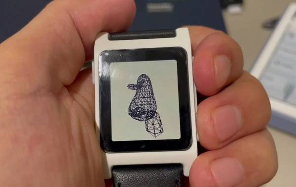

# "One Formula That Demystifies 3D Graphics" for pebble.h



Based on The Source Code from this YouTube Video from Tsoding:

[](https://www.youtube.com/watch?v=qjWkNZ0SXfo)

Git repo: https://github.com/tsoding/formula

## How to run

- You'll need Pebble SDK: https://developer.rebble.io/sdk/
- Actual hardware is optional, the SDK contains emulators for Pebble smartwatches

```
$ git clone https://github.com/innokentiyt/formula-pebble.git
$ cd formula-pebble
$ pebble build && pebble install --emulator flint
```

## Model

The model is provided by [https://github.com/Max-Kawula/penger-obj](https://github.com/Max-Kawula/penger-obj)
